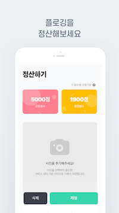
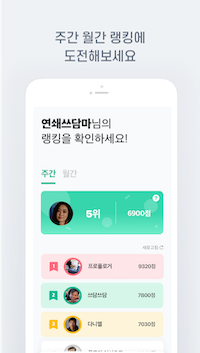

  <h1>
    EcoRun
  </h1>
    환경을 지키는 달리기, 에코런!

## Introduction

Nexters 18기 프로젝트.
플로깅 전용 서비스 에코런 iOS Client 레포.

**플로깅** 이란?
조깅을 하면서 길가의 쓰레기를 수거하는, 체육 활동과 자연 보호 활동이 합쳐진 개념을 의미하는 신조어.

## Key Feature

### Plogging

* 유저가 플로깅한 경로 시각화
* 플로깅 진행하면서 주운 쓰레기 카테고리 별로 입력 및 저장 UI/UX
* 진행 시간, 소모 칼로리, 이동 거리 등 유저 활동 통계
* 백그라운드 작업 지원
* 플로깅 이력 조회
* 플로깅 튜토리얼

### SNS

* 플로깅 썸네일 제작 기능
* 친구 피드 구경 기능
* 인스타그램에 공유 기능
* 기간 별 플로깅 랭킹 서비스

### Login

* 소셜 로그인 기능 

## Tech

- GPS
- UI (Storyboard, Custom View, Auto Layout)
- Custom Camera
- Image Rendering
- Paging
- Animation
- Network module
- SNS Login (Apple, Naver, Kakao)

## Screen Shot

  

      
    	
    	
  

  

      
    	
    	
      
  

