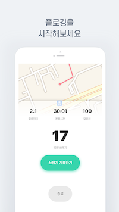

# Plogging
> 환경을 지키는 달리기, 에코런

## Team
- [전소영](https://github.com/jeon-soyeong) 
- [강태우](https://github.com/H0use96) 
- [김혜리](https://github.com/kimhyeri)

## Skills
- Core Data
- Core Location
- Mapkit
- Custom Camera
- Image Rendering
- Paging
- Animation
- Network module
- SNS Login (Apple, Naver, Kakao)

## Key Color
-  `#37d5ac`

## Screenshot

## Download
- [App Store](https://apps.apple.com/kr/app/%EC%97%90%EC%BD%94%EB%9F%B0/id1553907014)
